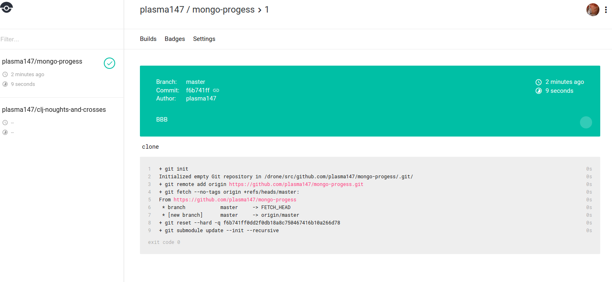

# terraform-drone-play
Provisioning drone server / client using terraform.

Very simple (not production ready!) example.

Creates 2 instances in AWS:
   * A drone server which has it's frontend publically available on port 80.
   * A drone node which points to the drone server.

There are 8 variables that need to be passed to terraform to allow it to do its thing:

|Terraform Variables:    | Explain        | Default       |
|------------------------|----------------|---------------| 
| access_key             | AWS access key |    N/A        |
| secret_key             | AWS secret     |    N/A        |
| region                 | AWS region     |    us-east-1  |
| private key            | Absolute file path to secret key to allow ssh to created instances  | N/A |
| github_client          | client id for github oauth application | N/A |
| github_secret          | secret for github oauth application | N/A |
| drone_admin_user       | login for drone server | N/A |
| drone_secret           | The drone secret for allowing nodes to connect to server | N/A |

Steps:

 * Acquire access token and secret for AWS that has required permissions to allow provisioning instances.
 * Create a ssh keypair in AWS - ideally for a user with restricted permissions.
 * Create github oauth application temporary putting in placeholder homepage and authorisation callback url.
 * Record client id and client secret. 
 * Create a terraform.tfvars file with the required variables. 
 * Run `terraform apply` and wait...
 * Once the server has been provisioned copy public dns from amazon console and put as github oauth application home page url, e.g: `http://ec2-00-00-000-00.compute-1.amazonaws.com/`
 * Change authorization callback url to `http://ec2-00-00-000-00.compute-1.amazonaws.com/authorize`.
 * Hit server endpoint in browser `http://ec2-00-00-000-00.compute-1.amazonaws.com/` and click login.
 * In the top right hand menu click `account` and activate project that you wish to build.
 * Upload appropriate `.drone.yml` file to the root of the project.  
 * Trigger build via a push and watch build live in drone server.

Limitations:

  * does apt-get installs docker on creation which is incredibly slow. Purpose built amis would be quicker.
  * provisions docker via ssh / trusts hosted install script
  * Very little security: no ssl, publically exposed ports, no login required.. etc.

